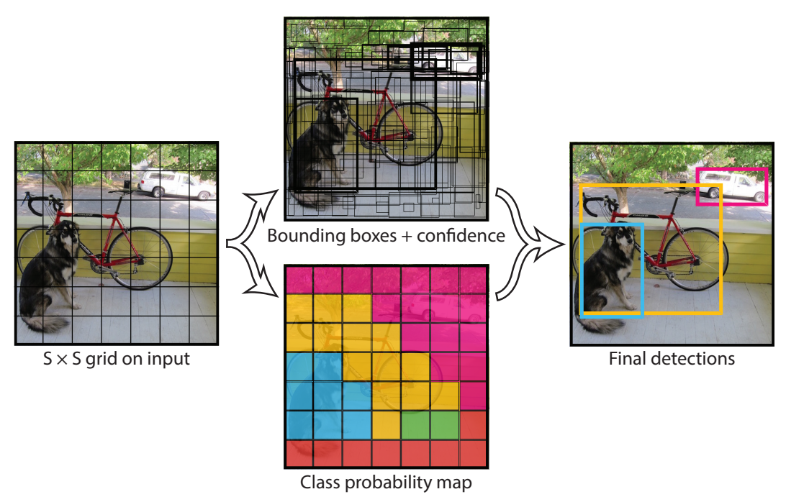
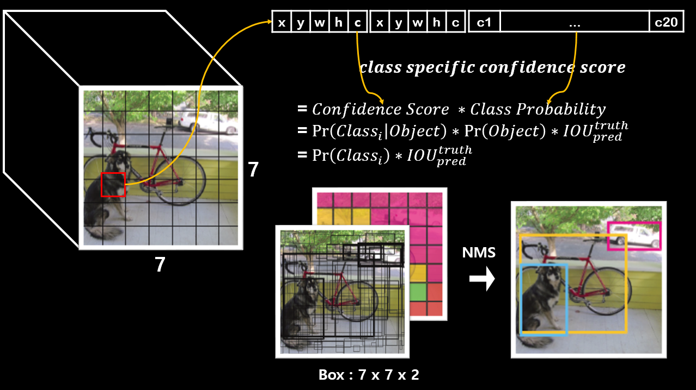
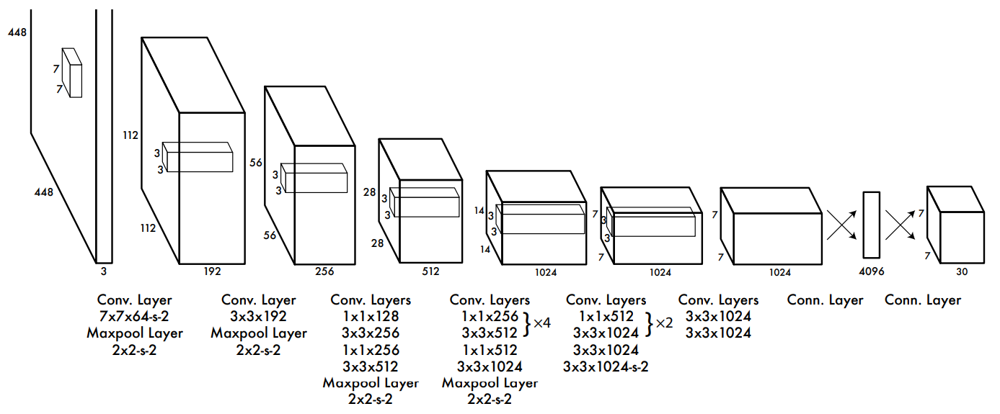
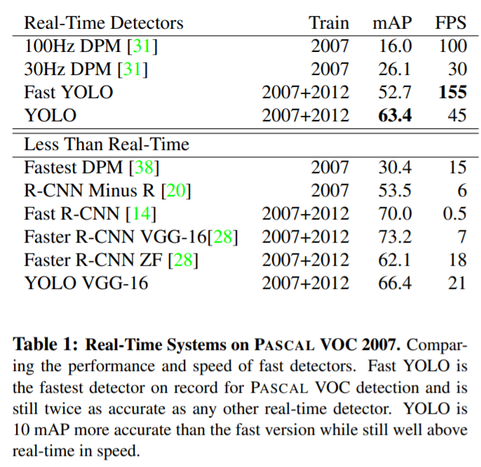
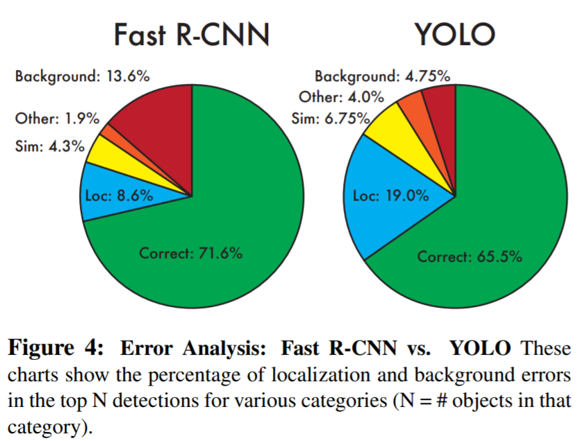
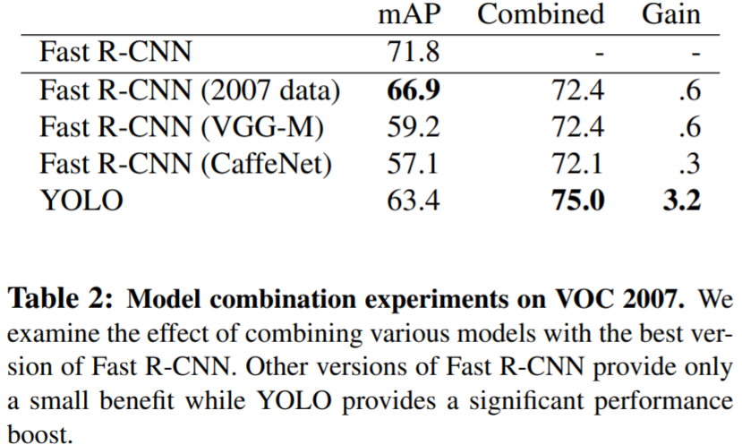
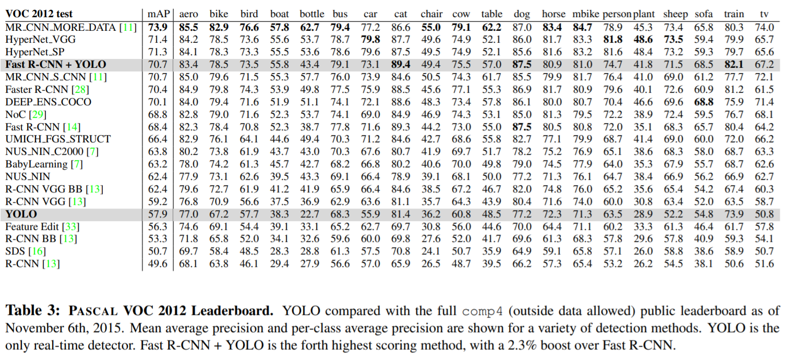

# YOLOv1

* Paper : [https://arxiv.org/abs/1506.02640](https://arxiv.org/abs/1506.02640)

Object Detection에 대한 새로운 접근법(one stage object detection) YOLO(You Only Look Once)가 처음 제안된 논문입니다.

* 통합된 구조(bounding box + class probability)를 가지기 때문에 빠릅니다.
* `45 FPS / 155 FPS(Fast)`

### Unified Detection

<figure><figcaption></figcaption></figure>

* S x S grid (S = 7)
* B(num of bounding box) = 2

$$Confidence Score : Pr(Object) * IOU^{truth}_{pred}$$

* C(num of class) = 20

$$Confidence Class probability : Pr(Class_i | Object)$$

* output tensor : 7 x 7 x (B x 5(x, y, w, h, confidence) + C)
* test time

$$Pr(Class_i | Object) * Pr(Object) * IOU^{truth}_{pred} = Pr(Class_i) * IOU^{truth}_{pred}$$

<figure><figcaption></figcaption></figure>

### Network Design

<figure><figcaption></figcaption></figure>

* GoogLeNet 기반 모델
* Convolution Layer : 24개, 9개(Fast)
* Fully Connected Layer : 2개

### Loss Function

* $$i$$ : Object가 존재하는 Grid Cell
* $$j$$ : Predictor Bounding Box
* $$1^{obj}_{i, j}$$ : Object가 존재하는 경우 grid cell의 predictor bounding box
* $$1^{noobj}_{i, j}$$ : Object가 존재하지 않는 경우 grid cell의 predictor bounding box
* $$1^{obj}_{i}$$ : Object가 존재하는 경우 grid cell

이미지 대부분에는 object가 없을 것이고 confidence는 전부 0으로 수렴하려고 할 것 입니다. 그로 인해 발생되는 gradient가 너무 커지는 현상을 막아주기 위해서 추가 parameter를 사용합니다.

* $$\lambda_{coord}$$ : x, y, w, h loss의 균형을 위한 parameter. (defalut : 5)
* $$\lambda_{noobj}$$ : object loss의 균형을 위한 parameter. (defalut : 0.5)

1. x, y의 loss를 구합니다.
2. w, h의 loss를 구합니다. (가로, 세로의 제곱근을 예측합니다.)
3. confidence score의 loss를 구합니다. ($$C_i = 1$$)
4. confidence score의 loss를 구합니다. ($$C_i = 0$$)
5. conditional class probability의 loss를 구합니다.

### Training

* ImageNet 1000-class competition dataset으로 20개의 convolution layer, avg pooling layer, fully connected layer를 가진 모델에 pretraining 합니다. 합니다.
* randomly initialized weights를 가지는 4개의 convolution layer와 2개의 fully connected layer를 추가합니다.
* 세부적인 시각정보를 위해 해상도를 224 x 224에서 448 x 448로 늘렸습니다.
* bounding box의 폭과 높이를 정규화(0 \~ 1) 하였습니다.
* 마지막 Layer에 linear activation function을 사용하였고 나머지 다른 layer에는 leaky relu를 사용합니다.

**parameters**

* `epoch` : 135
* `batch` : 64
* `momentum` : 0.9
* `weight decay` : 0.0005
* `learning rate` : 0.001 -> 0.01 -> 0.001 -> 0.0001
  * `75 epoch` : 0.01
  * `30 epoch` : 0.001
  * `30 epoch` : 0.0001
* `dropout rate` : 0.5
* `data augmentation`
  * random scaling
  * HSV 색상 공간에서 최대 1.5배 까지 exposure과 saturation을 임의로 조정합니다.

### Inference

* one stage라서 매우 빠릅니다.
* 이미지당 98개의 bounding box와 각 box에 대한 class probability를 예측합니다.
* 각 object당 하나의 bounding box로 예측한다.
* 큰 object나 여러개의 셀의 테두리에 근처에 있는 물체는 예측하기 어렵습니다. NMS로 해결할 수 있지만 R-CNN 만큼 성능에 크게 영향을 미치지는 않습니다.

### Limitation

* Small Object가 모여 있으면 잘 검출하지 못합니다.
* Localization Error가 높습니다.

### Benchmark

<figure><figcaption></figcaption></figure>

* Yolo는 빠르고 강력합니다.
* Yolo 이전에 사용된 real time object detection 보다 성능이 좋습니다.

<figure><figcaption></figcaption></figure>

* Yolo가 Fast-RCNN 보다 Localization Error가 좋지 않습니다.
* Yolo가 Fast-RCNN 보다 Background Error가 좋습니다.

<figure><figcaption></figcaption></figure>

* Yolo와 Fast-RCNN을 결합해서 사용하면 좋습니다.

<figure><figcaption></figcaption></figure>

* 클래스 별로 정확도를 비교한 표 입니다.
