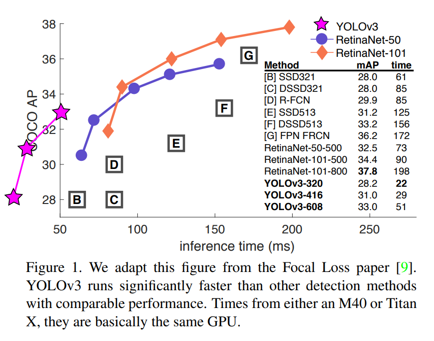
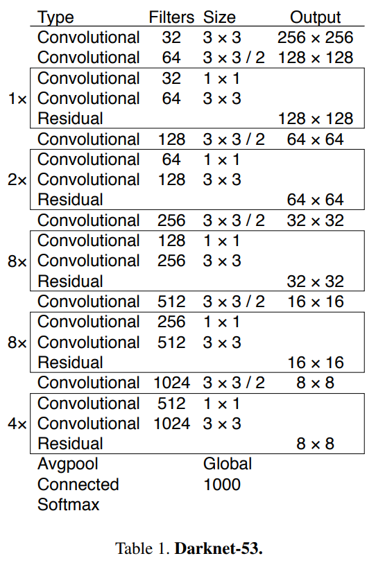
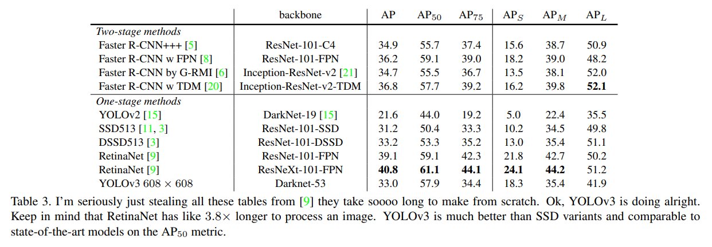

# YOLOv3

* Paper : [https://pjreddie.com/media/files/papers/YOLOv3.pdf](https://pjreddie.com/media/files/papers/YOLOv3.pdf)

YOLOv2 이후 나온 논문을 적용해 Object Detection의 약점들을 해결하려는 실험을 합니다.

정확성은 높지만 여전히 빠릅니다!

* SSD보다 3배 빠르지만 정확도는 높습니다.
* RetinaNet과 정확도가 유사하지만 빠릅니다.

<figure><figcaption></figcaption></figure>

## Bounding Box Prediction

* YOLOv2는 Anchor Box로 Dimension cluster를 사용해서 Bounding Box를 예측합니다.
* $$t_x, t_y, t_w, t_h$$를 에측하고 좌상단 부터 시작해 $$c_x, c_y$$ 만큼 offset되고 bounding box의 width, height가 $$p_w, p_h$$인 경우 최종 bounding box는 $$b_x, b_y, b_w, b_h$$입니다.

<figure><figcaption></figcaption></figure>

* L2 loss를 사용해 학습했고 YOLOv3는 이 식을 뒤집어서 바로 $$\hat{t}_* - t_*$$을 계산하도록 합니다. 즉, ground truth를 $$t_x, t_y, t_w, t_h$$로 만든다는 의미 입니다.
* 만약 bounding box가 다른 box보다 ground truth와 많이 겹치는 경우 IOU는 1이어야 합니다. 만약 IOU가 제일 좋은 것이 아니면서 임계값 이상의 IOU를 가진다면 예측을 무시합니다. 각 ground truth에 1개의 bounding box만 할당합니다.
* IOU 임계값은 0.5입니다.
* bounding box가 ground truth에 포함되지 않는 경우 classification loss는 없고 objectness loss만 가집니다.

## Class Prediction

* 각 bounding box는 multi-label classification을 사용합니다.
* multi-label classification은 softmax가 좋지 않기 때문에 binary cross-entropy loss를 사용합니다.

## Predictions Across Scales

* YOLOv3는 서로 다른 스케일을 가지는 3가지 box를 예측합니다.
* feature pyramid networks와 유사한 방식으로 특징을 추출합니다.
* 몇개의 convolutional layer가 추가되고 출력은 3-d tensor 입니다.
* `N x N x [3 * (4(bounding box offsets) + 1(objectness) + 80(class))]`
* 이전의 2번째 layer에서 feature map을 2배 Upsampling 합니다.
* 초기부터 feature map을 가져와 Upsampling된 feature map과 concat합니다. 이 방법을 사용하면 의미있는 정보(이전 layer)와 세분화 된 정보(초기 layer)를 얻을 수 있습니다.
* 결합 된 feature map을 처리하기 위해서 convolutional layer를 추가합니다.
* 최종 scale의 box를 예측하기 위해서 같은 디자인을 한번더 수행합니다. 따라서 3번째 scale의 예측은 모든 이전 layer와 초기의 세분화되고 의미있는 정보를 활용합니다.
* k-means를 통해 anchor box를 clustering하고 9개의 cluster와 3개의 scale를 임의로 선택해 cluster를 균등하게 나눕니다.
* COCO의 경우 `(10 × 13), (16 × 30), (33 × 23), (30 × 61), (62 × 45), (59 × 119), (116 × 90) , (156 × 198), (373 × 326)` 입니다.

## Feature Extractor

특징 추출을 위한 DarkNet53을 제안합니다.

<figure><figcaption></figcaption></figure>

DarkNet53을 다른 모델과 비교합니다. 데이터셋은 ImageNet을 사용합니다.

<figure><figcaption></figcaption></figure>

## Training

* mining같은 방법을 사용하지 않습니다.
* multi-scale training, data augmentation, batch normalization 등 많은 방법을 사용합니다.

## How We Do

<figure><figcaption></figcaption></figure>

* COCO의 이상한 mAP를 사용하면 SSD 변형과 동일하지만 3배는 빠릅니다. 하지만 이러한 측정법으로 RetinaNet과 같은 모델보다 약간 성능이 좋지 않습니다.
* `IOU = 0.5`에서 AP50를 볼때 YOLOv3는 강력합니다.
* IOU의 threshold가 증가하면 Object와 Box를 완벽히 정렬하는데 어려움을 겪어 성능이 급격히 떨어집니다.
* 이전에 YOLO의 약점인 작은 물체를 검출하는 것이 훨씬 좋아졌습니다.

## Things We Tried That Didn't Work

* anchor box의 x, y offset을 예측 : linear activation을 사용해서 box의 width, height의 배수로써 anchor box의 x, y를 예측을 시도했지만 좋지 않았습니다.
* Linear x, yt predictions instead of logistic : logistic activation대신 linear activation을 사용해 x, y의 offset을 예측하려 했지만 몇 포인트 정도의 mAP 성능을 낮춥니다.
* Focal Loss : mAP가 2% 떨어집니다. 이미 objectness, classification이 잘되었기 때문이라고 하지만 확신할 수 없다고 합니다.
* Dual IOU thresholds and truth assignment : Faster RCNN에서 고안된 방법으로 두개의 IOU값을 사용합니다. 예측 IOU가 0.7이상이면 긍정적인 sample이고 0.3이하면 부정적인 sample입니다. 결과는 좋지 않았습니다.

## What This All Means

YOLOv3는 정확하고 빠릅니다. 하지만 COCO metric(0.5 \~ 0.95까지 조금씩 늘리면서 평가하는 방법)으로는 좋지 않지만 AP50 metric은 좋습니다. [Russakovsky et al.](http://ai.stanford.edu/\~olga/papers/RussakovskyCVPR15.pdf)은 사람들에게 IOU가 0.3, 0.5인 bounding box를 구분하도록 하게 했지만 구분을 잘 못했다고 합니다. 그 말은 즉슨 COCO metric처럼 세밀한 평가 방법이 정말 좋은지에 대한 의견을 말합니다.

Rebutter는 YOLO benchmarking의 위치, COCO metric이 약한 이유를 더 세밀하게 풀어내지만 직접적으로 다루지 않겠습니다.
