# YOLOv4

* Paper : [https://arxiv.org/abs/2004.10934](https://arxiv.org/abs/2004.10934)

기존 YOLOv3까지 저자셨던 `Joseph Redmon`이 참여하지 않았습니다.

YOLOv4는 YOLOv3이후에 나온 딥러닝의 정확도를 개선하는 다양한 방법을 적용해 YOLO의 성능을 극대화 하는 방법을 설명합니다.

.PNG>)

위에 표를 보면 속도는 유사하지만 정확도가 매우 많이 개선되었습니다.

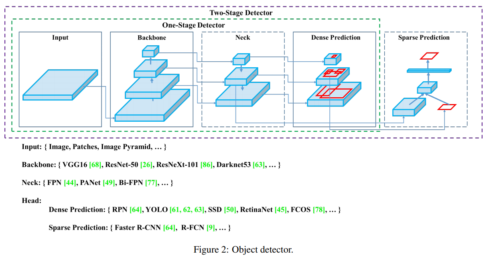

최근 표준화된 Object Detection의 모델 구조에 대해 요약하면 위와 같습니다. 깔끔하게 정리되서 한눈에 보기 쉽습니다.

YOLOv4는 다양한 기법들을 2가지 범주로 묶어서 설명합니다.

* BOF(Bag Of Freebies)
* BOS(Bag Of Specials)

### Bag Of Freebies

추론속도는 유지하지만 학습 전략을 바꾸거나 학습 비용을 증가시켜 정확도를 높이는 방법

#### Data Augmentation

원본 데이터셋의 과적합을 막고 적은 데이터셋의 효과를 극대화하기 위한 방법

* Photometric Distortions : brightness, contrast, hue, saturation, noise
* Geometric Distortions : random scaling, cropping, flipping, rotating
* CutOut
* Random Erase
* MixUp
* CutMix
* GAN

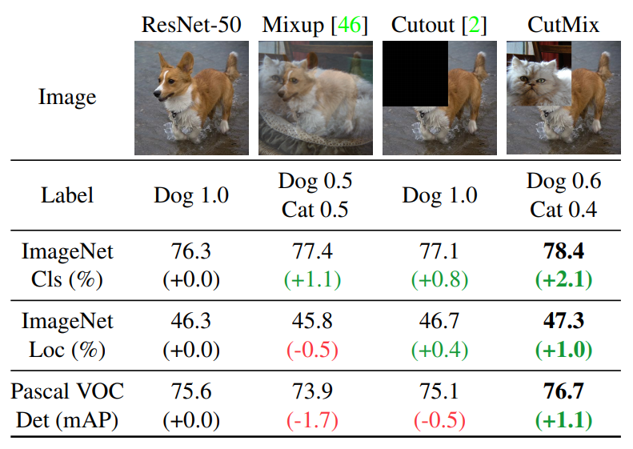

여기서 Random Erase는 CutOut과 비슷한데 CutOut은 제거한 영역을 0으로 채우는 반면, Random Erase는 랜덤한 값으로 채웁니다.

#### Semantic Distribution Bias

데이터셋에 특정 라벨이 많거나 하는 경우에 대한 불균형을 해결하기위한 방법

* Hard Negative Example Mining

Hard Negative란 Negative를 Positive라고 예측하기 쉬운 데이터입니다. 그래서 Hard Negative Mining이란 Hard Negative 데이터를 모아서 원래 데이터에 추가해서 학습하는 방법입니다. 이로인해 False Negative 오류에 강해집니다.

* Focal Loss

분류하기 쉬운 샘플의 경우 학습에 기여도는 낮기 때문에 비효율적이다. 이러한 문제를 해결하기 위한 새로운 손실 함수다.

$$Cross entropy = -log(p_t)$$

$$Focal Loss = -(1 - p_t)^{\gamma}log(p_t), \quad \gamma \geq 0$$

기존 Cross Entropy에 $$(1 - p_t^{\gamma})$$라는 factor가 하나 포함되어있고 이 factor의 scale은 $$\gamma$$로 조절합니다. 이로인해 쉬운 예제의 경우 손실에 기여도를 낮출수 있다.

* Label Smoothing

데이터셋 라벨링의 실수 가능성을 포함하는 방법입니다.

고양이 사진이 있는 경우 라벨을 \[고양이: 1 | 개: 0] 으로 정답을 라벨링하는 것이 아니라 \[고양이: 0.9 | 개: 0.1]로 합니다.

```
new labels = one hot labels * (1 - label smoothing value) + label smoothing value / num classes

IF 0.2인 경우

1 * (1 - 0.2) + 0.2 / 2 = 0.9
0 * (1 - 0.2) + 0.2 / 2 = 0.1
```

#### Bounding Box Regression

* GIOU(Generalized Intersection over Union)
* CIOU(Complete Intersection over Union)
* DIOU(Distance Intersection over Union)


### Bag Of Specials

약간의 추론 속도 증가를 통해 정확도를 높이는 방법

#### SPP

SPM(Spatial Pytamid Matching)에 의해 개발 된 모듈입니다. 원래 SPM 방법은 특징 맵을 동일한 d x d 블록으로 나눈 뒤, spatial pyramid를 형성하고 bag-of-word를 사용해 features를 추출합니다.

SPP는 딥러닝에 최적화 하기 위해 CNN와 SPM을 결합하고 bag-of word 대신 maxpooling을 사용합니다.

#### ASPP

ASPP(Atrous Spatial Pyramid Pooling)은 향상된 SPP로 DeepLapV3에서 제안된 방법입니다. 다양한 dilated ratio(6, 12, 18, 24)를 가지고 합성곱 연산을 한 뒤 concat하여 연산합니다.

약 7% 추론시간이 증가하지만 5.7% 정확도가 향상됩니다.

#### RFB

RFB(Receptive Field Block Net)

#### SE

SE(Squeeze-and-Excitation)


약 2% 연산량이 증가지만 1% 정확도가 향상 된다. 하지만 GPU에서 추론시간이 10% 증가한다.

#### SAM

SAM(Spatial Attention module) 0.1% 연산량이 증가하고 0.5% 정확도가 향상된다. GPU 추론시간에 영향이 없다.

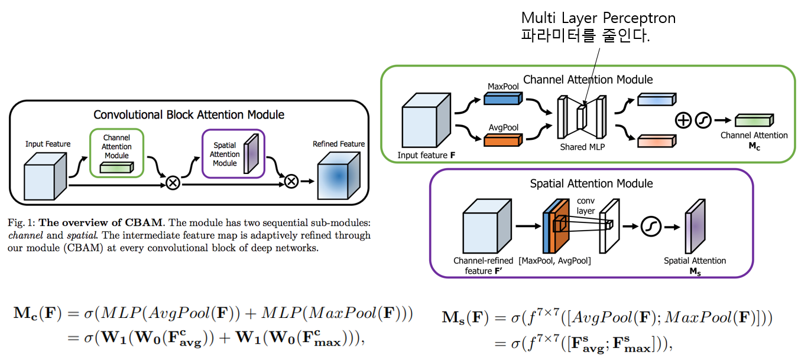

#### SFAM

SPAM(Scale-wise Feature Aggregation Module)은 SE 모듈을 사용해 multi scale이 연결 된 특징 맵에서 channelwise level re-weighting을 합니다.

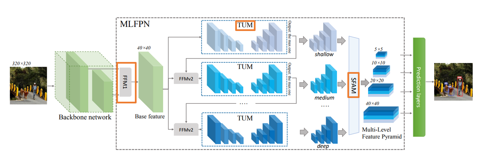

SFAM 논문에서 사용 된 모델의 전체적인 흐름을 나타냅니다.

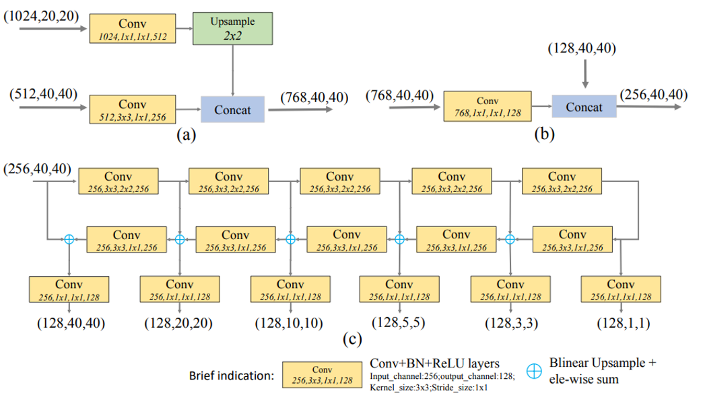

(a) : FFMv1 (b) : FFMv2 (c) : TUM

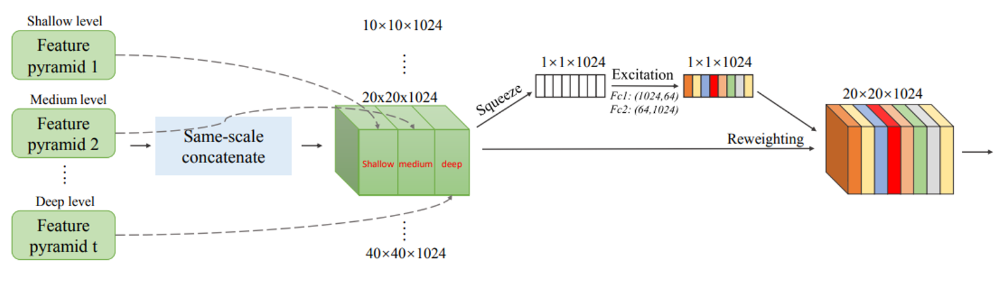

SFAM을 묘사한 그림입니다.

#### ASFF

ASFF(Adaptively Spatial Feature Fusion)

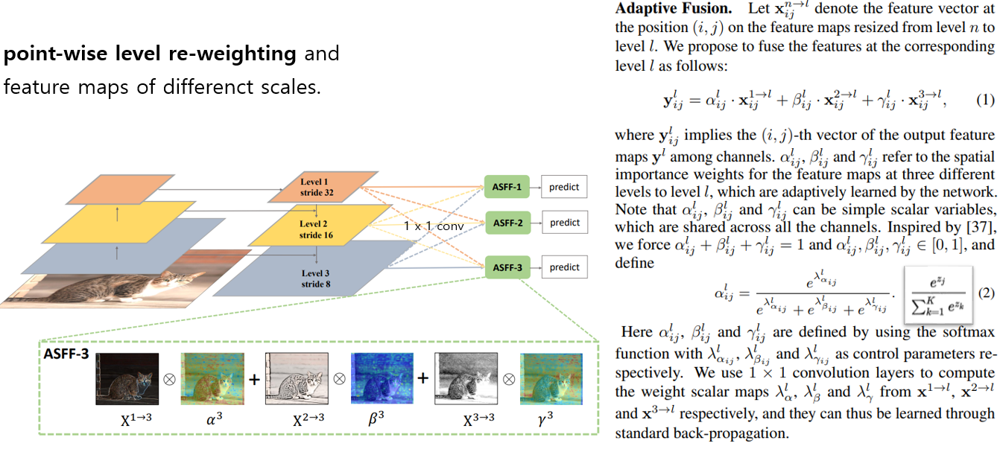

#### BiFPN

multi input weighted residual connections는 scale-wise level re-weighting을 실행한 다음 다른 스케일의 특징 맵을 추가하기 위해서 제안됩니다.

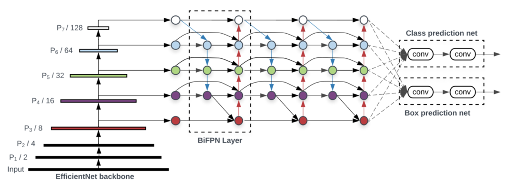

#### Activation Function

* LReLU, PReLU : ReLU가 0보다 작은 경우 기울기가 0이라는 문제를 해결
* ReLU6 ,Hard-Swish : Quantization network를 위해 설계됨
* SeLU : 네트워크를 정규화하기 위해서 사용된다.
* Mish
* ...

활성화 함수는 ReLU나 기존 활성화 함수 조합으로 생겨난 것이 많고 궁금한 내용만 찾아보시면 될 것 같습니다.

#### NMS

* NMS
* Soft NMS

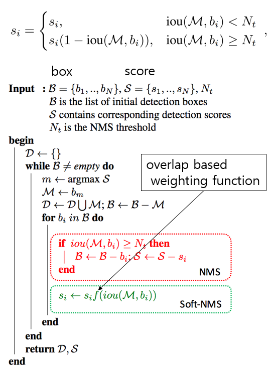

겹치는 bouning box를 후처리 해주는 작업은 위에 식으로 표현할 수 있습니다.

### Selection of Architecture

* Objective
  * Input Network Resolution
  * Convolution Layer Number
  * Parameter Number
  * Number of Layer Output
* CSPResNeXt50 : ImageNet(Classification)
* CSPDarkNet53 : MS COCO(Object Detection)

classification이 최적인 모델이라고 해서 detector에서도 최적이 아닙니다.

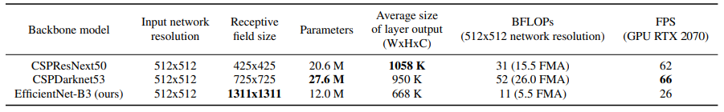

* 높은 입력 해상도 : 작은 크기의 객체를 검출
* 더 많은 계층 : 증가 된 해상도를 커버하기 위한 더 높은 receptive field
* 더 많은 매개변수 : 크기가 다른 여러개의 객체를 검출하는 모델의 용량을 늘리기 위함

제일 합당한 모델은 DarkNet이라고 할 수 있습니다.

YOLOv3는 CSPDarkNet53에 SPP 블록을 추가하고 YOLOv3에서 사용되는 FPN대신 PANet을 사용합니다.

**CSP**

CSP(Cross-Stage-Partial-Connections)

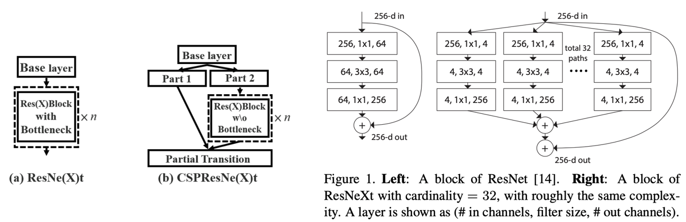

특징 맵 채널의 절반만 Residual Block을 통과하기 때문에 Bottleneck layer를 사용 할 필요가 없습니다.

**New Method**

* SAT
* Mosaic
  * 4개의 학습 이미지를 혼합한다.
  * Mini Batch가 크지 않아도 된다.(혼합 자체로 효과적임)

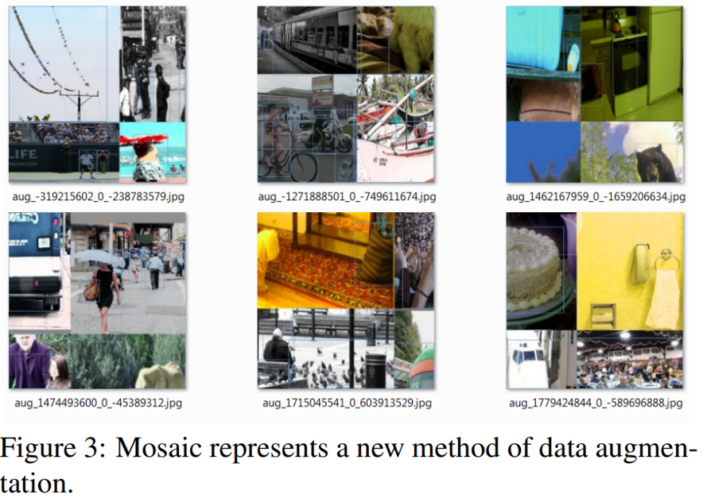

* modified SAM
* modified PAN

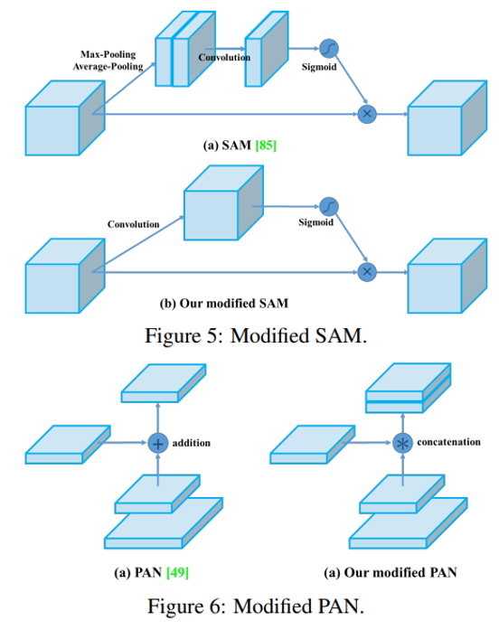

* Cross mini-Batch Normalization(CmBN)

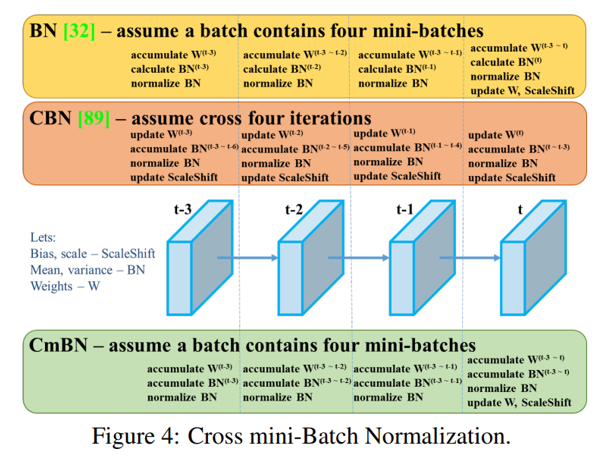

**Activation**

* ReLU, LReLU, PReLU, ReLU6, SELU, Swish, Mish

**Bouding box regression loss**

* MSE, IoU, GIoU, CIoU, DIoU

**Data Augmentation**

* CutOut, MixUp, CutMix

**Regularization method**

* DropOut, DropPath, Spatial DropOut, or DropBlock

**Normalization of the network activations by their mean and variance**

* Batch Normalization (BN)
* Cross-GPU Batch Normalization (CGBN or SyncBN)
* Filter Response Normalization (FRN)
* Cross-Iteration Batch Normalization (CBN)

**Skip-connections**

* Residual connections
* Weighted residual connections
* Multi-input weighted residual connections
* Cross stage partial connections (CSP)

### YOLOv4

* Backbone : CSPDarkNet53
* Neck : SPP, PAN
* Head : Yolov3
* Bag of Freebies for backbone : CutMix, Mosaic, DropBlock, Class label smoothing
* Bag of Specials for backbone : Mish, CSP, Muiti-input weighted residual connections(MiWRC)
* Bag of Freebies for detector : CIoU, CmBN, DropBlock, Mosaic, Self Adversarial Training, Eliminate grid sensitivity, Using multiple anchors for a single ground truth, Cosine anneling scheduler, Optimal hyper parameters, Random training shapes
* Bag of Specials for detector : Mish, SPP, SAM, PAN, DIoU NMS

### Experiments

* training steps : 8,000,000
* batch size : 128 / mini batch size 32
* learning rate : 0.1 warm-up : 1000
* momentum : 0.9 / weight decay : 0.005
* BoF experiments : data augmentation 검증
* BoS experiments : activation function 검증
* genetic algorithm : hyper parameter search (lr : 0.00261, momentum : 0.949, IoU thresholds : 0.213, loss normalizer : 0.07)

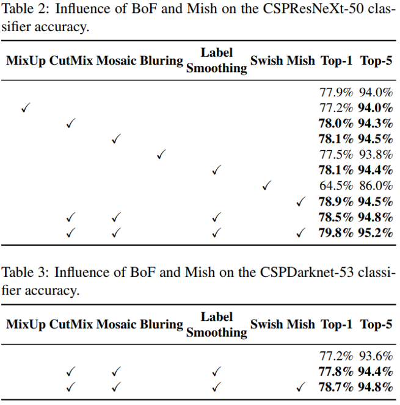

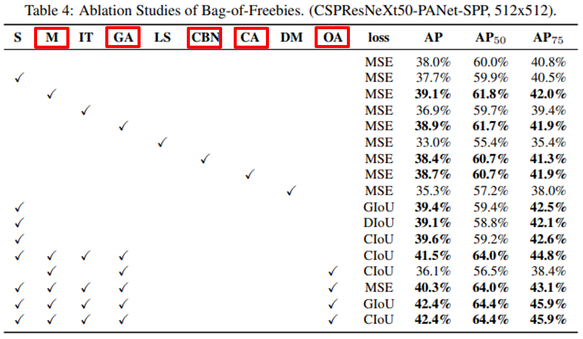

* S : Eliminate grid sensitivity : sigmoid에 1.0을 초과하는 계수를 곱해 object가 검출되지 않는 grid의 영향을 제거한다.
* M : Mosaic
* IT : IoU threshold (single GT > IoU threshold)
* GA : genetic algorithm (hyperparameter search)
* LS : class label smoothing
* CBN : CmBN
* CA : cosine anneling
* DM : dynamic minibatch size
* OA : optimized anchors

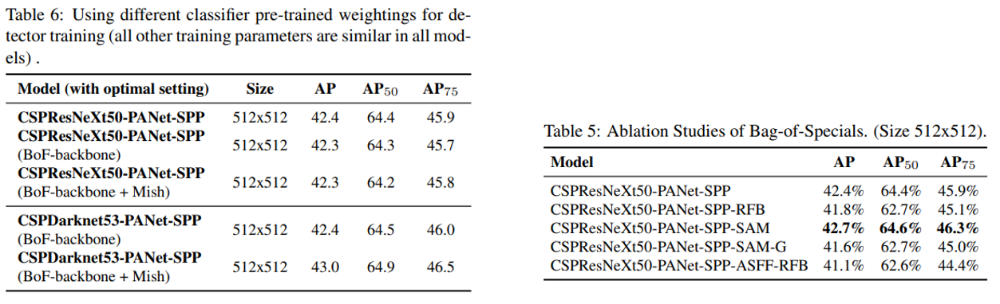

* classification accuracy가 높다고 detector accuracy가 항상 높은건 아닙니다.
* CSPResNet50의 classification accurac가 높지만 detector accuracy는 CSPDarkNet53이 더 높습니다.
* CSPResNet50에 BoF, Mish를 사용하면 classification accuracy는 높아지지만 detector accuracy는 낮아집니다.


* CSPDarkNet53에 BoF, Mish를 사용하면 detector accuracy가 높아집니다.
* BOF, BOS를 추가한 뒤 mini batch size가 성능에 거의 영향을 미치지 않습니다.
  * 즉, 고가의 GPU는 불필요합니다.

### Result

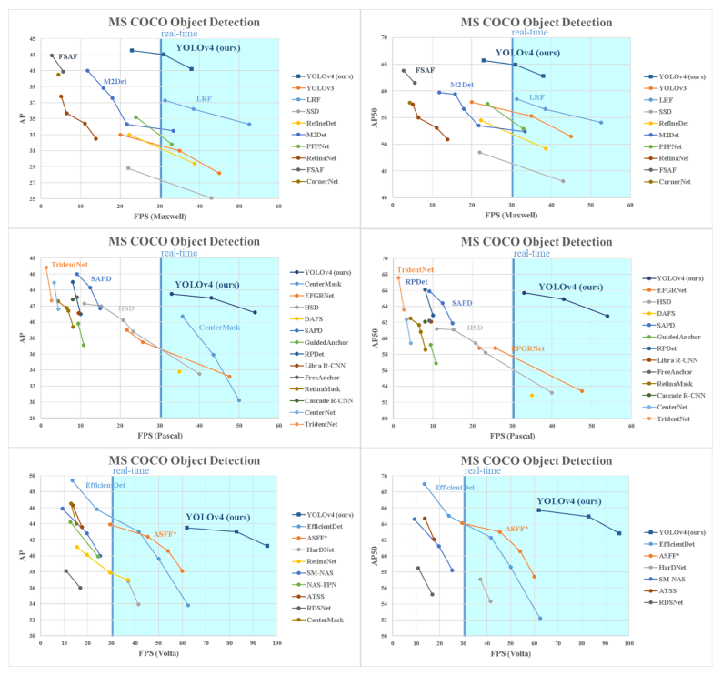
